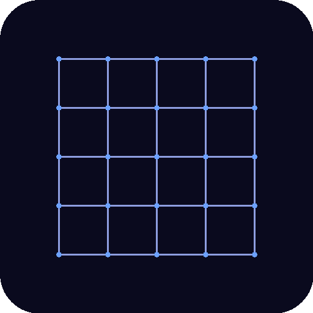

<p align="center">
  
</p>

<h1 align="center">ClawSCAD</h1>

<p align="center">
  <strong>AI-powered 3D CAD environment</strong><br>
  OpenSCAD + Claude Code with checkpoint branching, auto-iteration, and live PBR viewport
</p>

---

ClawSCAD wraps [OpenSCAD](https://openscad.org/) and [Claude Code](https://github.com/anthropics/claude-code) into a single Electron desktop app. Describe what you want to build, Claude writes the OpenSCAD code, the app renders it in a live 3D viewport, and every iteration is saved as an immutable checkpoint you can branch from at any time.

## Features

**3D Viewport**
- PBR rendering with environment-mapped reflections (Three.js)
- Orbit, pan, zoom — mouse, touch, and keyboard
- Wireframe, edge overlay, orthographic/perspective toggle
- 7 camera presets (Front/Back/Left/Right/Top/Bottom/Iso)
- Click any part to inspect dimensions, volume, weight, and estimated print cost
- 6 colour swatches for instant model recolouring
- Split viewport — open a second independent 3D view
- Screenshot export

**Checkpoint History**
- Every `.scad` file Claude writes is a permanent, numbered checkpoint
- Claude never overwrites — it always creates a new file
- Click any checkpoint to load it instantly (cached in memory)
- Branch from any point and explore design alternatives without losing previous work
- Right-click context menu: rename, delete, view source, resume session

**Monaco Editor**
- Full OpenSCAD syntax highlighting (custom Monarch grammar)
- Read-only by default, toggle to edit mode
- Error markers (red squiggles) on OpenSCAD error lines
- Find / Replace (Ctrl+F / Ctrl+H)

**Claude Code Integration**
- Embedded xterm.js terminal running Claude Code
- OpenSCAD MCP server auto-configured — Claude can render, validate, and inspect models programmatically
- `CLAUDE.md` injects mandatory rules: never overwrite files, use colours, validate with MCP tools
- Auto-iteration: on render failure, ClawSCAD writes errors to `RENDER_ERRORS.md` and prompts Claude to fix them
- Dual terminal support (up to 2 Claude instances simultaneously)
- Multi-window support (up to 4 projects)

**Export**
- STL, 3MF, and PNG export
- 3MF preserves per-part colours
- Print cost estimation (configurable infill, material, cost/kg)

## Install

```bash
git clone https://github.com/toyuvalo/ClawSCAD.git
cd ClawSCAD
npm install
npm start
```

**Prerequisites:**
- [Node.js](https://nodejs.org/) 18+
- [OpenSCAD](https://openscad.org/downloads.html) installed and in PATH (or set `OPENSCAD_BINARY` env var)
- [Claude Code](https://github.com/anthropics/claude-code) installed globally: `npm install -g @anthropic-ai/claude-code`

## Usage

1. Launch ClawSCAD — workspace created at `~/clawscad-workspace/`
2. Claude Code starts in the terminal panel
3. Describe what you want: *"Make a gear with 20 teeth and a 5mm shaft hole"*
4. Claude writes a `.scad` file — ClawSCAD auto-renders it in the viewport
5. If the render fails, ClawSCAD tells Claude to fix it automatically
6. Click any checkpoint in the History panel to go back and branch
7. Export to STL/3MF when done

## Keyboard Shortcuts

| Shortcut | Action |
|---|---|
| `Ctrl+N` | New viewport (split view) |
| `F5` | Force re-render |
| `1`–`7` | Camera presets |
| `R` | Reset view |
| `F` | Zoom to fit |
| `W` | Toggle wireframe |
| `E` | Toggle edges |
| `O` | Toggle ortho/perspective |

## Architecture

```
ClawSCAD/
├── main.js       Electron main — multi-window, project state, render queue, MCP client
├── renderer.js   Three.js viewport, xterm.js terminal, Monaco editor, checkpoint tree
├── preload.js    IPC bridge
├── index.html    Layout
└── style.css     Dark theme
```

- **Rendering**: OpenSCAD CLI (`openscad -o output.3mf input.scad`), 3MF first, falls back to STL
- **MCP**: `openscad-mcp-server` subprocess, JSON-RPC, exposes render/validate/analyze tools to Claude

## Related

- [SmartSCAD](https://github.com/toyuvalo/SmartSCAD) — fork using Anthropic/OpenAI APIs directly instead of the Claude Code CLI

## License

MIT — see [LICENSE](LICENSE).
