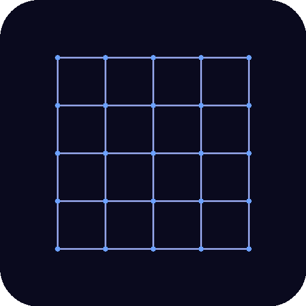

<p align="center">
  
</p>

<h1 align="center">ClawSCAD</h1>

<p align="center">
  <strong>AI-powered 3D CAD environment</strong><br>
  OpenSCAD + Claude Code with checkpoint branching, auto-iteration, and live PBR viewport
</p>

<p align="center"><a href="https://webdev.dvlce.ca/openscad">Project page →</a></p>

---

ClawSCAD wraps [OpenSCAD](https://openscad.org/) and [Claude Code](https://github.com/anthropics/claude-code) into a single Electron desktop app. Describe what you want to build, Claude writes the OpenSCAD code, the app renders it in a live 3D viewport, and every iteration is saved as an immutable checkpoint you can branch from at any time.


## Making something

You do not need to know CAD, and you do not need to know which part of the app to use.

1. **Pick what you're making** — a grid of print types: screws & hardware, brackets & mounts,
   boxes & cases, furniture, structural, replacement part, models & figures, home decor,
   toys & games, or *something else*.
2. **Describe it in plain English** — *"an M4 standoff 20 mm long"*, *"a squat owl planter with
   big round eyes"*. Optional guided fields (thread size, height, what it has to fit) appear for
   the type you picked; every one of them is optional.
3. **Press the button.** That's it.

Picking a type sets the print settings and the modelling approach for you — walls, tolerances,
resolution, orientation rules, whether it's built parametrically or sculpted. Those controls are
all still there, demoted to a *Fine-tune* row, if you want them.

**Obvious things just get made.** A standoff with a thread and a length has one right answer, so
ClawSCAD goes straight to a printable model. **Things that are a matter of taste get checked
first**: it generates a few reference pictures and asks *"is this the thing?"* before spending ten
minutes on a mesh. For a replacement part it asks for a photo of the real object instead, because
that is what actually makes it fit.

The app always tells you which of those it chose and why, in one sentence, and you can always
override it — *Show me options first* / *Skip the check, just make it*.

## Features

**3D Viewport**
- PBR rendering with environment-mapped reflections (Three.js)
- Orbit, pan, zoom — mouse, touch, and keyboard
- Wireframe, edge overlay, orthographic/perspective toggle
- 7 camera presets (Front/Back/Left/Right/Top/Bottom/Iso)
- Click any part to inspect dimensions, volume, weight, and estimated print cost
- 6 colour swatches for instant model recolouring
- Split viewport — open a second independent 3D view
- Screenshot export

**Checkpoint History**
- Every `.scad` file Claude writes is a permanent, numbered checkpoint
- Claude never overwrites — it always creates a new file
- Click any checkpoint to load it instantly (cached in memory)
- Branch from any point and explore design alternatives without losing previous work
- Right-click context menu: rename, delete, view source, resume session

**Monaco Editor**
- Full OpenSCAD syntax highlighting (custom Monarch grammar)
- Read-only by default, toggle to edit mode
- Error markers (red squiggles) on OpenSCAD error lines
- Find / Replace (Ctrl+F / Ctrl+H)

**Claude Code Integration**
- Embedded xterm.js terminal running Claude Code
- OpenSCAD MCP server auto-configured — Claude can render, validate, and inspect models programmatically
- `CLAUDE.md` injects mandatory rules: never overwrite files, use colours, validate with MCP tools
- Auto-iteration: on render failure, ClawSCAD writes errors to `RENDER_ERRORS.md` and prompts Claude to fix them
- Dual terminal support (up to 2 Claude instances simultaneously)
- Multi-window support (up to 4 projects)

**Export**
- 3MF, STL, and PNG export — 3MF is the default because it is the only one that preserves per-part colour
- `--backend=Manifold` is used automatically when the resolved OpenSCAD supports it (~50× on boolean-heavy models)
- Print cost estimation (configurable infill, material, cost/kg)

## Generation Pipeline (`claw-gen`)

The **Generate** panel turns a sentence into a 3D sculpt: *text → candidate images → you pick one →
mesh → print-prep → a normal `.scad` checkpoint that `import()`s the mesh*. It is an optional
feature — ClawSCAD works fully without it, and the panel says so rather than failing quietly.

It is driven entirely by an external CLI called `claw-gen`; the app hardcodes nothing about image or
mesh providers. Backend names, availability, and reasons come only from `claw-gen backends --json`.

**Setting it up**

1. Install `claw-gen` (from the `clawscad-gen` project) and make sure `claw-gen backends --json`
   runs in a terminal.
2. In ClawSCAD, open the **Generate** panel and press **Locate claw-gen…** if it is not already on
   your `PATH`. The path is remembered per user, not per workspace.
3. Press **Try again** — the panel switches to the prompt box once a backend reports `ok`.

**What the three unconfigured states mean**

| The panel says | What is actually true | What to do |
|---|---|---|
| *No generation pipeline configured* | No `claw-gen` on `PATH` and none located | Install it, or press **Locate claw-gen…** |
| *`claw-gen` failed to start* | It ran, but crashed or printed nothing parsable (its stderr is shown) | Fix the install or its `config.toml` |
| *No image backend available right now* | It ran fine, but every image backend reports unavailable — often `busy` under local memory pressure | Wait, or select an API backend instead of the local one |

**While a job runs** the panel auto-expands and shows a four-stage stepper (images → mesh → prep →
checkpoint) with an elapsed timer; a failed stage stays visibly failed rather than silently
clearing. A mesh job takes roughly ten minutes, so completion also raises an OS notification when
the window is unfocused.

**The result is a starting point, not a finished part.** A generated checkpoint is mesh-derived —
it is badged `GEN` in the checkpoint tree with a diamond node. Branch it and `difference()` your
parametric features into the import; never edit it in place. Anything tolerance-critical (snap
fits, threads, mating parts) should be modelled parametrically from the start.

## Install

```bash
git clone https://github.com/toyuvalo/ClawSCAD.git
cd ClawSCAD
npm install
npm start
```

**Prerequisites:**
- [Node.js](https://nodejs.org/) 18+
- [OpenSCAD](https://openscad.org/downloads.html) installed and in PATH (or set `OPENSCAD_BINARY` env var)
- [Claude Code](https://github.com/anthropics/claude-code) installed globally: `npm install -g @anthropic-ai/claude-code`

## Usage

1. Launch ClawSCAD — workspace created at `E:\clawscad-workspace\` on Windows, `~/clawscad-workspace/` elsewhere
2. Pick a print type in the **Make** panel, then describe what you want:
   *"a gear with 20 teeth and a 5 mm shaft hole"*
3. Press **Make it**. (Claude Code runs in the terminal below — you can watch it work, or ignore it.)
4. Claude writes a `.scad` file — ClawSCAD auto-renders it in the viewport
5. If the render fails, ClawSCAD tells Claude to fix it automatically
6. Click any checkpoint in the Checkpoints panel to go back and branch — the strip above the tree always names the checkpoint your next change will branch from
7. Export to STL/3MF when done

## Keyboard Shortcuts

| Shortcut | Action |
|---|---|
| `Ctrl+N` | New viewport (split view) |
| `F5` | Force re-render |
| `1`–`7` | Camera presets |
| `R` | Reset view |
| `F` | Zoom to fit |
| `W` | Toggle wireframe |
| `E` | Toggle edges |
| `O` | Toggle ortho/perspective |

## Architecture

```
ClawSCAD/
├── main.js       Electron main — multi-window, project state, render queue, MCP client
├── renderer.js   Three.js viewport, xterm.js terminal, Monaco editor, checkpoint tree
├── preload.js    IPC bridge
├── index.html    Layout
├── style.css     Dark theme
├── main/         Per-feature main-process modules (register(ipcMain, deps))
├── renderer/     Per-feature renderer modules, mounted through renderer/bus.js
├── presets/      Product data — print types (categories.json), intent presets, machine profile
└── docs/         Design contracts each feature package was built against
```

- **Rendering**: OpenSCAD CLI (`openscad -o output.3mf input.scad`), 3MF first, falls back to STL
- **MCP**: `openscad-mcp-server` subprocess, JSON-RPC, exposes render/validate/analyze tools to Claude

## Related

- [SmartSCAD](https://github.com/toyuvalo/SmartSCAD) — fork with multi-provider CLI support (Claude, Codex, Gemini)
- [webdev.dvlce.ca/openscad](https://webdev.dvlce.ca/openscad) — project page

## License

MIT with [Commons Clause](https://commonsclause.com/) — free to use, modify, and share. Commercial resale not permitted.
